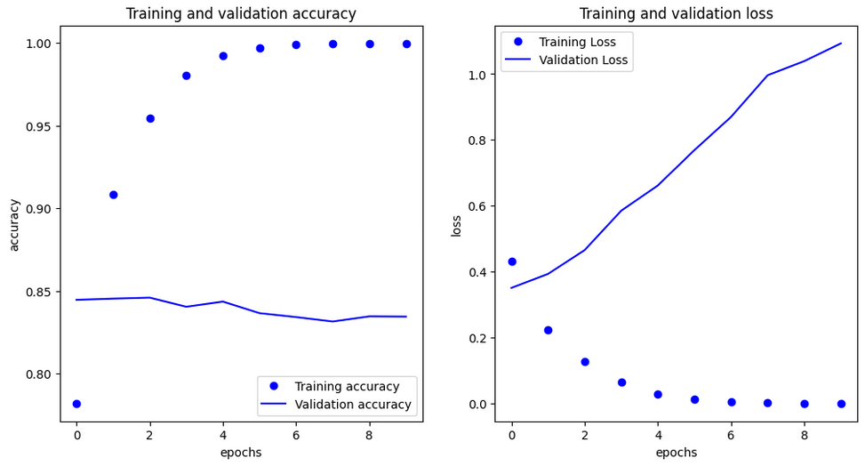

# Sarcasm Detection in News Headlines 📰

[](https://www.tensorflow.org/)
[](https://keras.io/)
[](https://www.python.org/)
[](https://numpy.org/)
[](https://matplotlib.org/)
[](https://jupyter.org/)
[](https://projector.tensorflow.org/)

## Overview 📖

This project demonstrates a **binary sarcasm classifier** for news headlines using [TensorFlow](https://www.tensorflow.org/) and [Keras](https://keras.io/). The repository contains three different model implementations:

1. **Basic Embedding with Global Average Pooling** - A simple and efficient model for baseline performance
2. **Bidirectional LSTM** - An advanced model architecture that captures sequence context in both directions
3. **1D Convolutional Neural Network** - A model that extracts local patterns and features from text

All models process raw text headlines, convert them into numerical sequences using text vectorization, and predict whether a headline is **sarcastic** 😏 or **not sarcastic** 📰.

---

## Table of Contents 📑

- [Overview](#overview-)
- [Features](#features-)
- [Dataset](#dataset-)
- [Model Architectures](#model-architectures-)
- [Getting Started](#getting-started-)
- [Code Structure](#-code-structure)
- [Results and Performance Comparison](#results-and-performance-comparison-)
- [TF.Data Pipeline Optimization](#tfdata-pipeline-optimization-)
- [Key Insights](#key-insights-)
- [TensorFlow Embedding Projector](#tensorflow-embedding-projector-)
- [Future Work](#future-work-)
- [Acknowledgements](#acknowledgements-)
- [Contact](#contact-)

---

## Dataset 📦

- **Source:** [News Headlines Dataset for Sarcasm Detection](https://www.kaggle.com/datasets/rmisra/news-headlines-dataset-for-sarcasm-detection)
- **Description:** News headlines labeled for sarcasm detection
- **Format:** JSON file with headlines and binary labels (`0 = not sarcastic`, `1 = sarcastic`)
- **Training Split:** 20,000 samples for training, remainder for validation
- **Preprocessing:** Text standardization, tokenization, and padding to fixed length

---

## Model Architectures 🏗️

### Basic Model with Global Average Pooling

```
Input Layer (32 tokens max)
    ↓
TextVectorization (10,000 vocab)
    ↓
Embedding Layer (16 dimensions)
    ↓
GlobalAveragePooling1D
    ↓
Dense Layer (24 units, ReLU)
    ↓
Dense Layer (1 unit, Sigmoid)
    ↓
Binary Classification Output
```

### Bidirectional LSTM Model

```
Input Layer (32 tokens max)
    ↓
TextVectorization (10,000 vocab)
    ↓
Embedding Layer (16 dimensions)
    ↓
Bidirectional LSTM (32 units)
    ↓
Dense Layer (24 units, ReLU)
    ↓
Dense Layer (1 unit, Sigmoid)
    ↓
Binary Classification Output
```

### 1D Convolutional Neural Network

```
Input Layer (32 tokens max)
    ↓
TextVectorization (10,000 vocab)
    ↓
Embedding Layer (16 dimensions)
    ↓
Conv1D (128 filters, kernel size 5, ReLU)
    ↓
GlobalMaxPooling1D
    ↓
Dense Layer (6 units, ReLU)
    ↓
Dense Layer (1 unit, Sigmoid)
    ↓
Binary Classification Output
```

**Key Parameters:**
- Vocabulary Size: 10,000 tokens
- Max Sequence Length: 32 tokens
- Embedding Dimensions: 16
- LSTM Units: 32 (bidirectional, resulting in 64-dimensional output)
- Conv1D Filters: 128 with kernel size 5
- Training Examples: 20,000
- Padding Type: 'pre'
- Truncation Type: 'post'

---

## Getting Started 🛠️

### Prerequisites

- Python 3.x
- TensorFlow 2.x
- NumPy
- Matplotlib
- [Jupyter Notebook](https://jupyter.org/)

### Installation

```bash
git clone https://github.com/yourusername/sarcasm-detection
cd sarcasm-detection
pip install -r requirements.txt
```

### Usage

1. Download the sarcasm dataset from [Kaggle](https://www.kaggle.com/datasets/rmisra/news-headlines-dataset-for-sarcasm-detection) or use the provided `sarcasm.json` file.
2. Open and run the desired notebook:
   - `C3_W2_Lab_2_sarcasm_classifier.ipynb` - Basic model with GlobalAveragePooling
   - `C3_W3_Lab_5_sarcasm_with_bi_LSTM.ipynb` - Advanced model with Bidirectional LSTM
   - `C3_W3_Lab_6_sarcasm_with_1D_convolutional.ipynb` - Model with 1D Convolutional layer
3. Follow the notebook steps to:
   - Load and preprocess the data
   - Build and compile the model
   - Train with customizable parameters
   - Evaluate performance and visualize results
4. Export embedding weights for visualization in the [TensorFlow Embedding Projector](https://projector.tensorflow.org/).

---

## 📂 Code Structure

- `C3_W2_Lab_2_sarcasm_classifier.ipynb` - Basic model implementation with GlobalAveragePooling
- `C3_W3_Lab_5_sarcasm_with_bi_LSTM.ipynb` - Bidirectional LSTM model implementation
- `C3_W3_Lab_6_sarcasm_with_1D_convolutional.ipynb` - 1D Convolutional model implementation
- `sarcasm.json` - Dataset file (download separately)
- `requirements.txt` - List of dependencies
- `vecs.tsv` - Exported word vectors (generated after training)
- `meta.tsv` - Exported metadata (generated after training)

---

## Results and Performance Comparison 📊

### Basic Model (Global Average Pooling)
- **Training Accuracy:** ~96% after 10 epochs
- **Validation Accuracy:** ~84% (with some overfitting observed)
- **Model Size:** Fewer parameters, computationally efficient
- **Training Speed:** Fastest training time
- **Advantages:** Simple architecture, good baseline performance


### Bidirectional LSTM Model
- **Training Accuracy:** ~97% after 10 epochs
- **Validation Accuracy:** ~84-85% 
- **Model Size:** More parameters (174,129) but still lightweight
- **Training Speed:** Slower than the basic model but captures sequential information
- **Advantages:** Better captures word order and context in both directions


### 1D Convolutional Model
- **Training Accuracy:** ~98% after 10 epochs
- **Validation Accuracy:** ~85-86%
- **Model Size:** 139,399 parameters (less than LSTM, more than basic model)
- **Training Speed:** Faster than LSTM but slower than the basic model
- **Advantages:** Captures local n-gram patterns effectively, good at detecting key phrases



### Training Curves
The notebooks generate visualizations showing:
- Accuracy progression over epochs
- Loss reduction during training
- Training vs. validation performance comparison

---

## TF.Data Pipeline Optimization 🔄

Both models use TensorFlow's efficient data pipeline (`tf.data.Dataset`) with optimizations:
- Data caching
- Prefetching
- Shuffling with buffer
- Batching
- Efficient sequence padding

This results in faster training times and better resource utilization.

---

## Key Insights 🔍

1. **Bidirectional LSTM** captures word order and context in both directions, potentially improving performance on sequence-sensitive tasks
2. **1D Convolutional layers** with GlobalMaxPooling effectively identify the most important n-gram features in the text
3. **Global Average Pooling** model provides a simpler architecture with fewer parameters
4. **Text Vectorization** layer provides efficient preprocessing integrated into the model
5. All models show signs of **overfitting** after several epochs
6. **Validation accuracy** is similar across all three models (~84-86%), suggesting that for this specific dataset, the architecture choices provide marginal improvements
7. **Hyperparameter tuning** opportunities exist for vocabulary size, embedding dimensions, LSTM units, convolutional filters, and dense layer architecture

---

## TensorFlow Embedding Projector 🌐

Visualize the learned word embeddings with the [TensorFlow Embedding Projector](https://projector.tensorflow.org/):

1. After training, export embedding weights and metadata to `vecs.tsv` and `meta.tsv`.
2. Upload these files to the Embedding Projector.
3. Explore word relationships and clusters in the learned embedding space.
4. Discover how the model represents sarcastic vs. non-sarcastic language patterns.


---

## Future Work 🌱

- Experiment with different architectures (GRU, Transformer-based models)
- Implement regularization techniques to reduce overfitting (dropout, L2 regularization)
- Stack multiple Bidirectional LSTM layers for deeper context understanding
- Try hybrid models combining CNN and RNN features
- Experiment with different Conv1D filter sizes and number of filters
- Try different vocabulary sizes and embedding dimensions
- Add attention mechanisms for better context understanding
- Explore transfer learning with pre-trained embeddings (Word2Vec, GloVe)
- Multi-class classification for different types of sarcasm
- Ensemble multiple model types for potentially better performance

---

## Acknowledgements 🙏

Special thanks to:
- [Andrew Ng](https://www.andrewng.org/) for creating the Deep Learning AI curriculum
- [Laurence Moroney](https://twitter.com/lmoroney) for excellent instruction and developing the course materials  
- The creators of the [News Headlines Dataset for Sarcasm Detection](https://www.kaggle.com/datasets/rmisra/news-headlines-dataset-for-sarcasm-detection)
- This notebook was created as part of the TensorFlow Developer Certificate program by DeepLearning.AI

---

## Contact 📫

For inquiries about this project:
- [LinkedIn Profile](https://www.linkedin.com/in/melissaslawsky/)
- [Client Results](https://melissaslawsky.com/portfolio/)
- [Tableau Portfolio](https://public.tableau.com/app/profile/melissa.slawsky1925/vizzes)
- [Email](mailto:melissa@melissaslawsky.com)

---

© 2025 Melissa Slawsky. All Rights Reserved.
